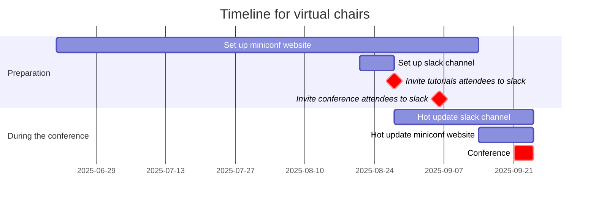
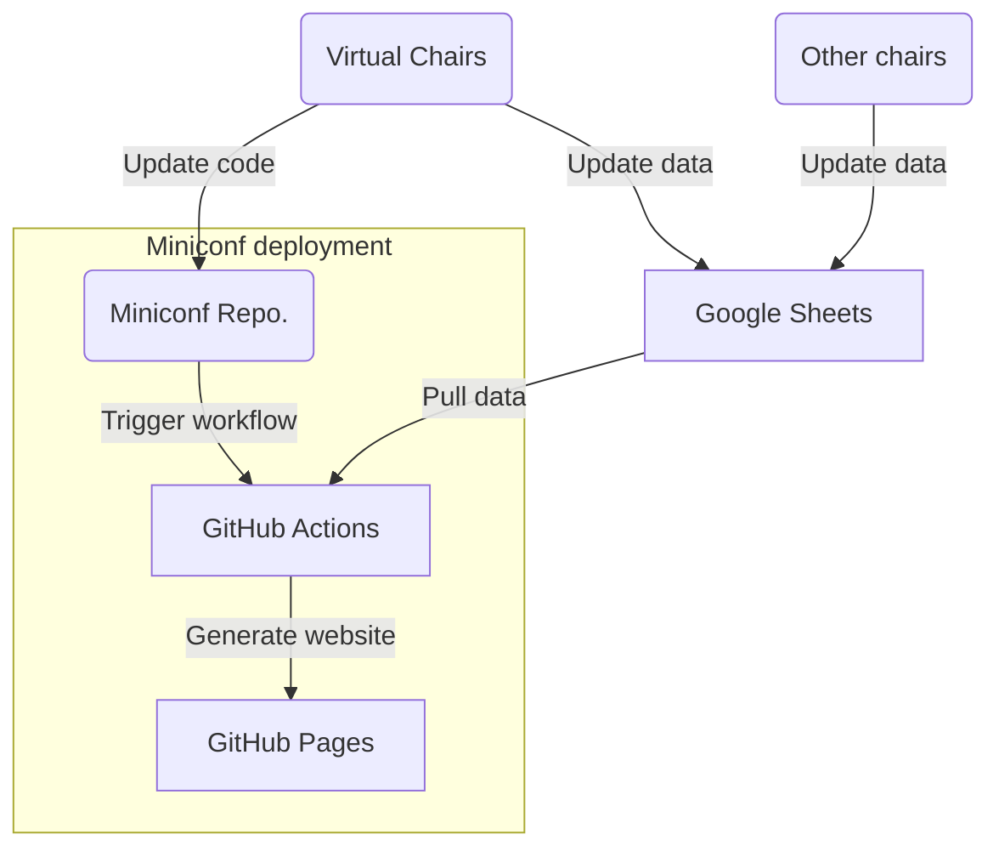

# Recap and reflection of the virtual side of ISMIR 2025

> __Author__:  Chin-Yun Yu

This document summarises what virtual chairs did for ISMIR 2025, and reflects on the rationale, consequences, and alternatives of the choices. 
Materials are from an internal presentation at C4DM, my memories, and conversations with other chairs.
This document is more of a note for myself and future chairs, rather than a comprehensive report as in [README](README.md).

## Table of contents

- [What virtual chairs did](#what-virtual-chairs-did)
- [Timeline suggestions](#timeline-suggestions)
- [Miniconf website](#miniconf-website)
  - [Hosting](#hosting)
  - [Compiling, updating, and centralising data](#compiling-updating-and-centralising-data)
  - [Confidentiality and privacy](#confidentiality-and-privacy)
- [ISMIR Slack workspace](#ismir-slack-workspace)
  - [Inviting attendees](#inviting-attendees)
  - [Inviting tutorial attendees](#inviting-tutorial-attendees)
- [Live streaming and recording](#live-streaming-and-recording)
- [Final thoughts](#final-thoughts)

## What virtual chairs did

Technically, virtual chairs were responsible for the following two main sites:

1. [Miniconf website](https://ismir2025program.ismir.net/): the main site that hosts papers and additional materials, the programme, and other information about the conference.
2. [Conference Slack channel](https://ismir2025.slack.com/): a communication platform for real-time discussions and coordination among participants.

Besides setting them up before the conference, virtual chairs also had to maintain them during (the most active period) and after (depending on the needs) the conference.

## Timeline suggestions

One of the things we could have done better is to set up the miniconf website earlier, as it turned out to be more work than we expected.
As a result, we didn't put much effort into the website design so it looks quite basic.
The Slack channel was easier since Slack has a very well-written [SDK](https://docs.slack.dev/tools/python-slack-sdk/) and only matters for a short period of time (from a few weeks before the conference to a few days after the conference).

A suggested timeline for the virtual chairs is as follows:

Detailed explanation will be discussed in the following sections.

## Miniconf website

The original [miniconf](https://www.mini-conf.org/) was made for ICLR 2020.
For ISMIR 2025, we built upon the fork from ISMIR 2023, as the 2024 version wasn't passed down to us.
The source code will be made available soon.

This year's version is rather simple.
We show the conference schedule per day, and host the accepted papers and late-breaking demos and their presentation materials.
A major difference this year is that we show the paper reviews if the authors didn't opt out.
No separate sponsors page is made, but we direct people to their Slack channel for sponsorship information.

### Hosting

The miniconf website can be made static, so we host it on GitHub Pages.
It's preferable if you have a GitHub Education Pack, which is free for academics and enables GitHub Pages for private repositories, to maintain data privacy.
Once the website is set up and ready to be published, request the custom domain `ismir20xxprogram.ismir.net` from the ISMIR Tech Lead (Ajay) and set up the DNS record to point to the GitHub Pages URL.

### Compiling, updating, and centralising data

There are contents that need to be updated frequently and not suitable to be committed to the repository.
These data include:

- Conference schedule
- Accepted papers, posters, videos, and slides
- Late-breaking demos and their materials
- Paper reviews (if not opted out)
- Music pieces for the music session
- etc.

Miniconf uses a csv file to store these data, and the static website is generated from the csv file.
We use Google Sheets to maintain the csv file.
The GitHub Actions workflow pulls the latest csv file from Google Sheets when deploying the website, so the website is always up-to-date.

Manually getting these data from different chairs is time-consuming and error-prone, so it's better to centralise the data collection and maintenance.
Thus, we made the spreadsheet editable by all chairs, and ask them to update the data in the spreadsheet directly.
This way, we can avoid the back-and-forth communication and potential errors in data entry.
What's left for virtual chairs is to check the data and make sure it can be parsed by the website generator, and to update the website when necessary.
It's helpful to know some Google Sheets cell formulas when filling a large amount of data to save time.

The website deployment workflow is like this:

This workflow helps a lot during the conference, as there were many last-minute requests from the authors, most of them related to updating the materials on the website.
Anyone who has the permission to edit the spreadsheet can update the data.
Once it's done, the virtual chairs just need to trigger the workflow to reload the website.
It's possible to create a script for others to trigger the workflow, further distributing the workload.

### Confidentiality and privacy

Always avoid committing sensitive data, like personal information or proprietary content, to the repository or making them visible to the public.
In addition to using private repositories, we also use repository secrets to store spreadsheet download credentials, which are only accessible to the GitHub Actions workflow and not visible to anyone else.

## ISMIR Slack workspace

Slack provides a convenient platform for real-time communication and coordination among conference participants.
We created channels for different purposes, such as general discussion, announcements, and specific topics related to the conference.

A shared oral presentation channel was created for sharing fun facts about the papers in real-time during the oral sessions.
These were handled by volunteers.
Each paper also has its own channel for discussions, which can be used by authors and attendees to ask questions and share insights about the paper.
We utilise the Slack API to automate the creation of channels and adding links to the corresponding miniconf page in the channel description, making it easier for attendees to know what this channel is about.
The Slack channel links for each session and paper are also shown on the miniconf website.
Dedicated private channels were created for each tutorial, and the attendees who purchased the tutorial were invited to the corresponding channels.

### Inviting attendees

This turned out to be trickier than we expected.
We use the email addresses from the registration form to invite attendees to the Slack workspace.
However, two issues arise:

1. The attendee **may not use the same email address** they registered with to join the Slack workspace, making it harder to verify their identity and grant them access to the appropriate channels.
2. Slack invitation link has a maximum number of uses (400) and is below the number of attendees for ISMIR 2025 (600~700), so we need to send multiple invitations. Moreover, before the first batch of invitations is accepted, we cannot send the next batch of invitations, which makes it hard to invite all attendees in a timely manner.

Both issues cannot be fully addressed using the current Slack invitation system.
The best we can do is put a reminder in the invitation email asking attendees to use the same email address they used for registration, and provide clear instructions on how to join the Slack workspace.
The second issue can be somewhat mitigated by sending out invitations earlier, probably one month before the conference, so that we have more time for each batch to be processed.

### Inviting tutorial attendees

The first issue in the previous section directly affects the tutorial attendees.
Since quite a large portion of the tutorial attendees did not join Slack with their registered email address, we had to manually check and identify them in the Slack workspace, and then add them to the corresponding tutorial channels.
Some tutorial attendees joined Slack right before or even during the tutorial.
Such help requests reached their peak on the tutorial days and we had to accommodate them immediately.

To reduce the hassle for both attendees and virtual chairs in the future, we recommend utilising the **default channels** feature in Slack, which allows us to automatically add new members to specific channels upon joining the workspace.
Specifically, we suggest the following setup:

1. Create Slack channels and add the tutorial channels to the default channels list.
2. Send out the Slack invitation email to all tutorial attendees.
3. Once enough tutorial attendees have joined the Slack workspace, remove the tutorial channels from the default channels list.
4. Send out the Slack invitation email to all conference attendees.

This should reduce the manual workload for virtual chairs.
The timeline shown in [Timeline suggestions](#timeline-suggestions) section is based on this setup.
However, how early the invitation should be sent out is still a question, as the registration will be open until the conference, and we don't want to send the links too early before enough attendees have registered.
From the registration data of ISMIR 2025, we found that one month before the conference, around 72% of the attendees had registered; two weeks before, around 84% had registered; and one week before, around 93% had registered.
(Here the percentage is calculated as $\frac{\text{registered attendees}}{\text{total attendees at the conference}} \times 100\%$.)
Future chairs can use this data to decide when to send out the invitations.

## Live streaming and recording

This year most of the sessions besides tutorials were live-streamed and recorded on [YouTube](https://www.youtube.com/@ISMIR2025).
This was handled by the local team at Daejeon.
We simply embedded the YouTube links on the miniconf website for easy access and announced them on the Slack channel.
The tutorials could be joined via Zoom, and the links were shared in the private channels.
We also used the same Google account to monitor the miniconf website activity using Google Analytics.

## Final thoughts

A few things I learned along the way:

1. Think ahead of participants' and chairs' needs and do as much preparation as possible. This is probably obvious, but it really helps to reduce the workload during the conference, which is already quite busy for everyone. 
2. Let others know what you can do and provide all the options. Sometimes other chairs may not be aware of the possibilities, so it's important to communicate and let them know. By providing all the options, we can see the whole picture better and come up with better solutions together.
3. Avoid duplicating information. When there is more than one source of truth, which one should we trust? This can lead to confusion and errors. This is also strongly related to the previous point: by communicating effectively, we can avoid creating multiple sources of truth and instead centralise the information in one place.
4. Make it possible for your colleagues to see what you’re working on. This can help them understand your work better and also provide feedback and suggestions. It doesn't have to be done in a very active way. For example, setting file permissions to team-wide read-only can already help a lot, as it allows others to access your work if they need to.

The last point was inspired by a recent talk [Working with the garage door up](https://youtu.be/hRglC84nWoc?t=25774) at ADCx Gather 2025 by Andy Normington, and I highly recommend watching the talk if you are working in a team and want to work in an effective way.

Lastly, I want to discuss a bit about the role of ISMIR virtual chairs.
Throughout the preparation, I felt that virtual chairs are somewhat similar to a team that makes internal tools for a company, at least in the coordination and communication aspect for miniconf.
The role requires tech skills that are broad rather than deep, and it also requires being proactive in understanding the needs of other chairs and providing solutions.
In addition, there is significant overlap between virtual chairs and web chairs.
For some information, like the conference schedule, we literally just copy it from the main conference website to the miniconf website.
Thus, I think it would be better if the virtual chairs and web chairs could be merged into one role, which is how the ISMIR 2023 organisers did.
This way, we could have a more streamlined workflow and reduce the communication overhead between different chairs.