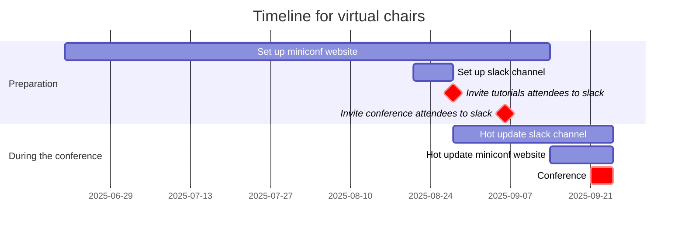
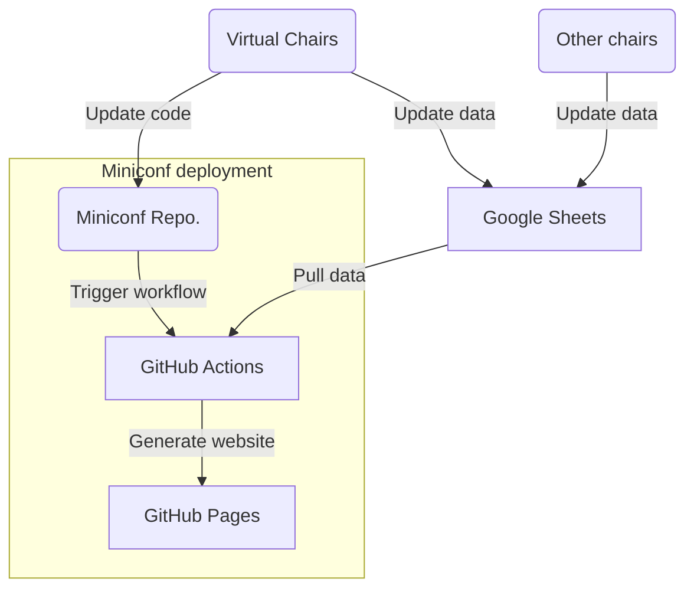

# Recap and reflection of the virtual side of ISMIR 2025

> __Author__:  Chin-Yun Yu

This document summarises what virtual chairs did for ISMIR 2025, and reflects on the rationale, consequences, and alternatives of the choices. 
Materials are from an internal presentation at C4DM, my memories, and conversations with other chairs.
This document is more of a note for myself and future chairs, rather than a comprehensive report as in [README](README.md).

## What virtual chairs did

Technically, virtual chairs were responsible for the following two main sites:

1. [Miniconf website](https://ismir2025program.ismir.net/): the main site that host papers and additional materials, programme, and other information about the conference. 
2. [Conference slack channel](https://ismir2025.slack.com/): a communication platform for real-time discussions and coordination among participants.

Besides setting them up before the conference start, virtual chairs also had to maintain them during (the most active period) and after (depending on the needs) the conference.

## Timeline suggestions

One of the things we could have done better is to set up the miniconf website earlier, as it turns out to be more work than we expected.
As a result, we didn't put much effort into the website design so it looks quite basic.
The slack channel was easier since slack has very well written [SDK](https://docs.slack.dev/tools/python-slack-sdk/) and only matters in a short period of time (from a few weeks before the conference to a few days after the conference).

A suggested timeline for the virtual chairs is as follows:

Detailed explanation will be discussed in the following sections.

## Miniconf website

The original [miniconf](https://www.mini-conf.org/) was made for ICLR 2020.
For ISMIR 2025, we built upon the fork from ISMIR 2023, as the 2024 version wasn't passed down to us.
The source code will be made available soon.

This year's version is rather simple.
We show the conference schedule per day, and host the accepted papers and late-breaking demos and their presentation materials.
A major difference this year is that we show the paper reviews if the authors didn't opt out.
No separate sponsors page is made, but we direct people to their slack channel for sponsorship information.

### Hosting

The miniconf website can be made static, so we host it on GitHub Pages.
It's preferrable if you have GitHub education pack, which is free for academics and can show GitHub pages for private repositories, to maintain data privacy.
Once the website is set up and ready to be published, request the custom domain `ismir20xxprogram.ismir.net` from the ISMIR Tech Lead (Ajay) and set up the DNS record to point to the GitHub Pages URL.

### Compiling, updating, and centralising data

There are contents that need to be updated frequently and not suitable to be committed to the repository.
These data include:

- Conference schedule
- Accepted papers, posters, videos, and slides
- Late-breaking demos and their materials
- Paper reviews (if not opted out)
- Music pieces for the music session
- .etc.

Miniconf uses a csv file to store these data, and the static website is generated from the csv file.
We use Google Sheets to maintain the csv file.
The GitHub Actions workflow pull the latest csv file from Google Sheets when deploying the website, so the website is always up-to-date.

Manually getting these data from different chairs is time-consuming and error-prone, so it's better to centralise the data collection and maintenance.
Thus, we made the spreadsheet editable by all chairs, and ask them to update the data in the spreadsheet directly.
This way, we can avoid the back-and-forth communication and potential errors in data entry.
What left for virtual chairs is to check the data and make sure they can be parsed by the website generator, and to update the website when necessary.
It's helpful to know some Google Sheets cell formulas when filling a large amount of data to save time.

The website deployment workflow is like this:

This workflow helps a lot during the conference, as there were many last-minute request from the authors, most of them related to updating the materials on the website.
Anyone who has the permission to edit the spreadsheet can update the data.
Once it's done, the virtual chairs just need to trigger the workflow to reload the website.
It's possible to make a script for others to trigger the workflow, to even the workload even more.

### Confidentiality and privacy

Always avoid committing sensitive data, like personal information or proprietary content, to the repository or making them visible to the public.
In addition to using private repositories, we also use repository secrets to store spreadsheet download credentials, which are only accessible to the GitHub Actions workflow and not visible to anyone else.

## Slack channel

## Live streaming and recording