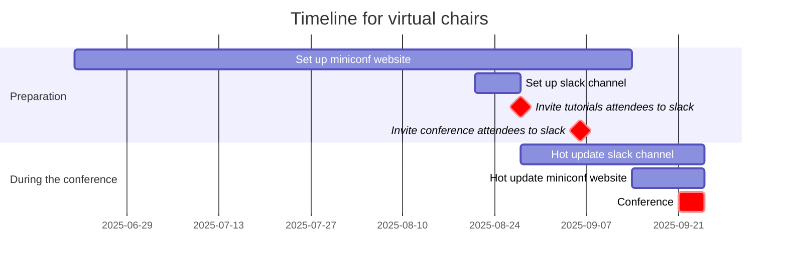

# Recap and reflection of the virtual side of ISMIR 2025

> __Author__:  Chin-Yun Yu

This document summarises what virtual chairs did for ISMIR 2025, and reflects on the rationale, consequences, and alternatives of the choices. 
Materials are from an internal presentation at C4DM, my memories, and conversations with other chairs.
This document is more of a note for myself and future chairs, rather than a comprehensive report as in [README](README.md).

## What virtual chairs did

Technically, virtual chairs were responsible for the following two main sites:

1. [Miniconf website](https://ismir2025program.ismir.net/): the main site that host papers and additional materials, programme, and other information about the conference. 
2. [Conference slack channel](https://ismir2025.slack.com/): a communication platform for real-time discussions and coordination among participants.

Besides setting them up before the conference start, virtual chairs also had to maintain them during (the most active period) and after (depending on the needs) the conference.

## Timeline suggestions

One of the things we could have done better is to set up the miniconf website earlier, as it turns out to be more work than we expected.
As a result, we didn't put much effort into the website design so it looks quite basic.
The slack channel was easier since slack has very well written [Bot API](https://api.slack.com/bot-users) and only matters in a short period of time (from a few weeks before the conference to a few days after the conference).

A suggested timeline for the virtual chairs is as follows:

Detailed explanation will be discussed in the following sections.